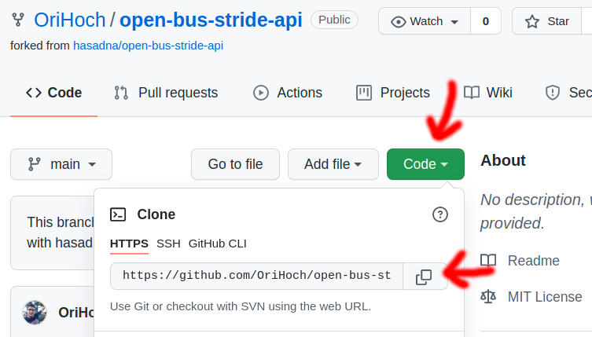
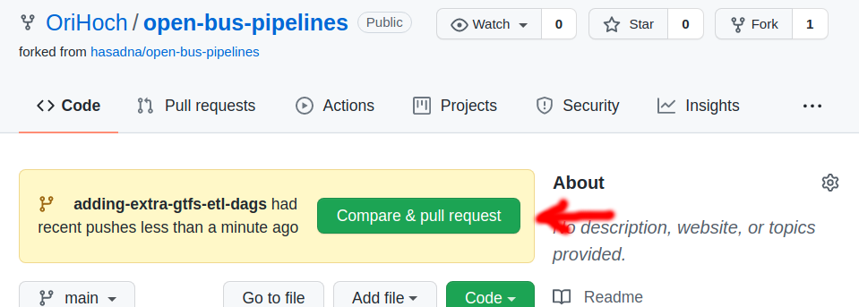
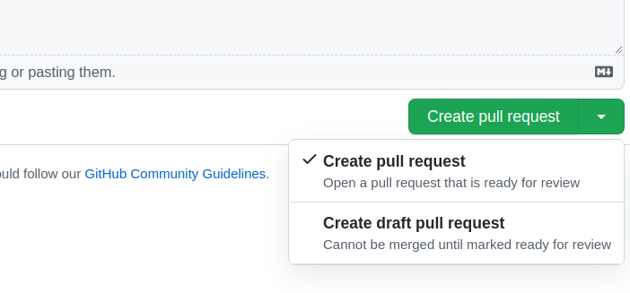

# Contributing to open-bus pipelines / stride projects

This doc details how to contribute to the different open-bus pipelines / stride projects.

## Preparing to contribute

Before contributing, follow these steps for the repository you want to contribute to:

* Fork the repository by accessing the relevant repository on GitHub and clicking the "Fork" button

* Access the forked repository and get the clone link

* Clone your forked repository locally using your favorite Git tool / your IDE.
  * Using PyCharm, from the menu click on "Git" -> "Clone", and paste the clone link
* Add a remote to the main (Hasadna) repository
  * Access the main repository in GitHub and get it's clone link
  * Add a remote named "hasadna" with the clone link URL
    * Using PyCharm, from the menu click on "Git" -> "Manage Remotes", and add this remote

## Working on a change

* Create a new branch for your change, the branch name should describe the change you intend to do
  * Using PyCharm, from the menu click on "Git" -> "New Branch"
* Pull the latest changes from the "hasadna" remote, "main" branch
  * Using PyCharm, from the menu click on "Git" -> "Pull", change the remote to "hasadna" and the branch should be "main"
* Make your changes and commit whenever you want, commit messages are not important
* Push your commits often so your work will not be lost
  * Using PyCharm, from the menu click on "Git" -> "Push"

## Opening a PR

If your work is not done yet, you can open a draft PR - 
this is useful to have other team-members look at your changes or to start preparing for the final PR.

When your work is done you can open a final PR or set your draft PR to ready for review.

For both cases, follow these steps to open a PR:

* In GitHub - access your forked repository, and you should see a notification for the branch you pushed to
* click the button "Compare & Pull Request"

 
* Give a descriptive title to your PR - describing the change you did
* Write a PR description detailing why you opened it / what changes are included in it and any additional relevant information.
* Click on either "Create pull request" or "Create draft pull request"

